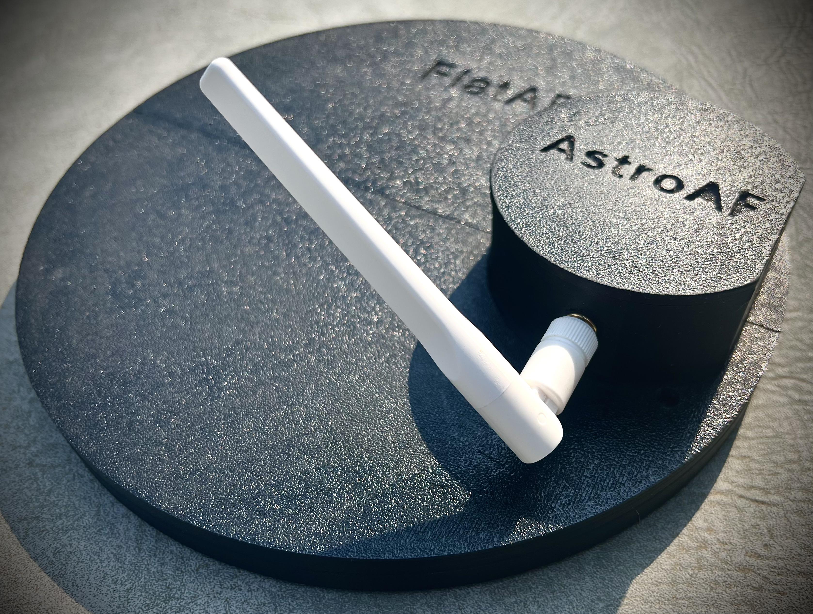
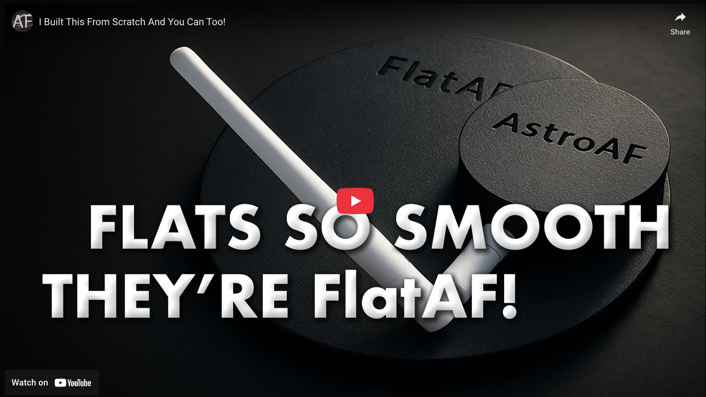
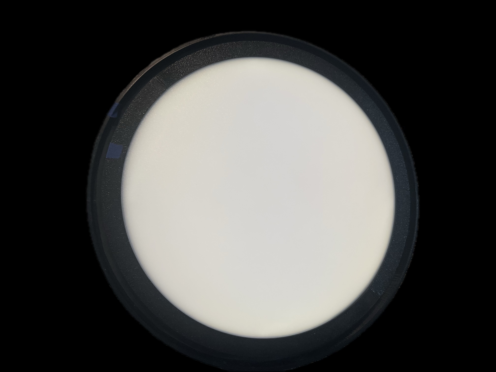
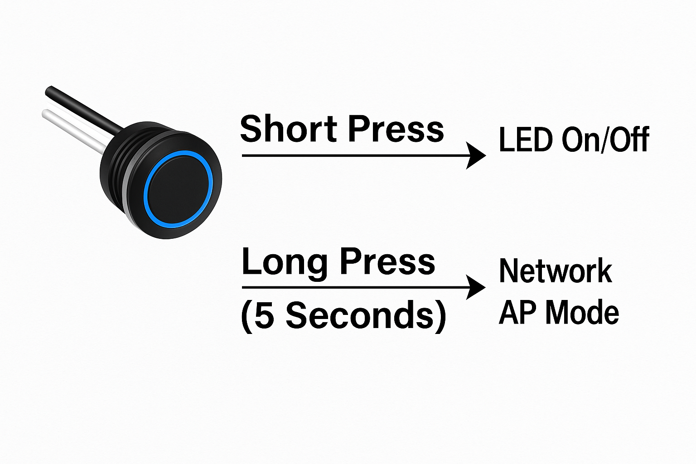
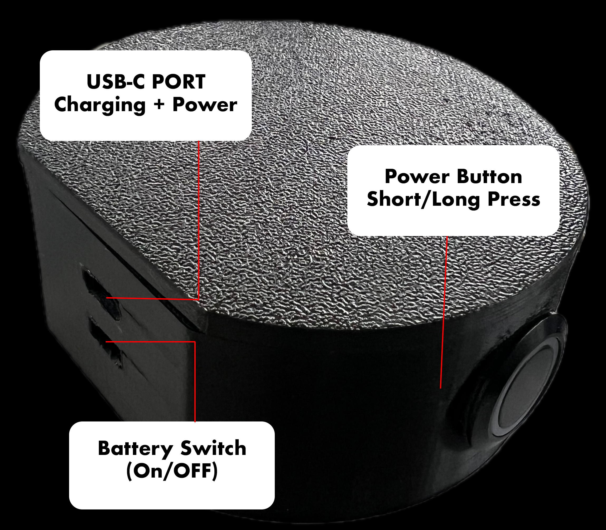
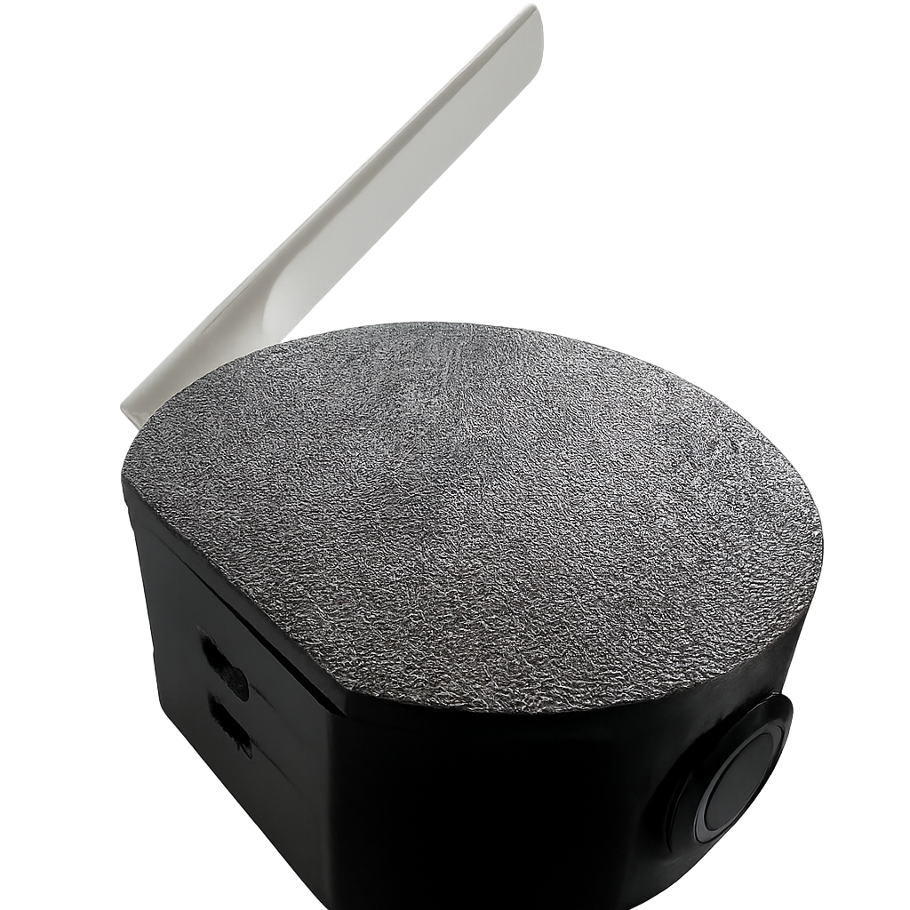
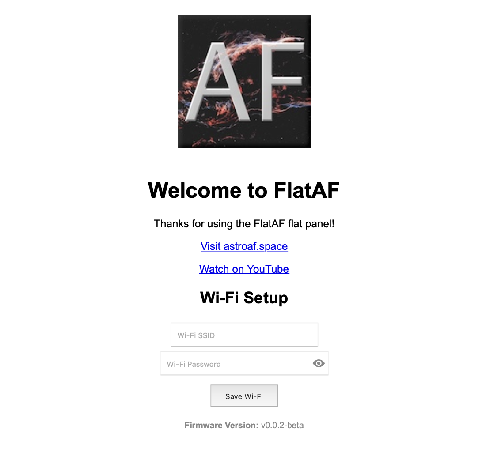
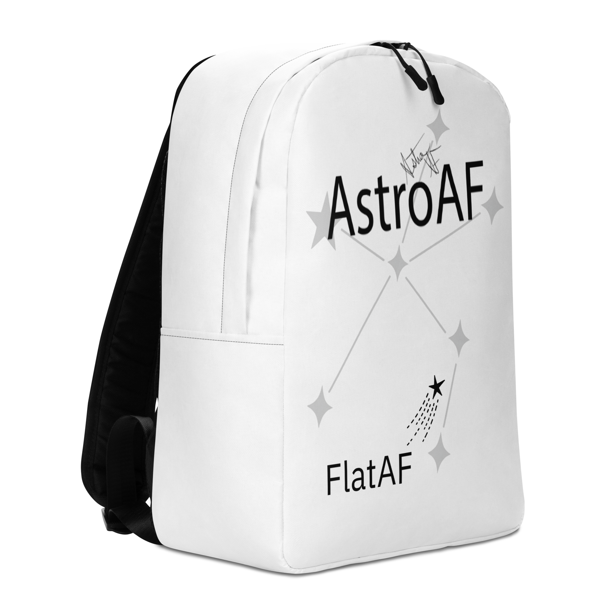

> **Disclaimer**  
> FlatAF is a DIY (Do-It-Yourself) project intended for educational and personal use. AstroAF does not manufacture or sell FlatAF panels and provides no warranties, guarantees, or support for third-party builds or modifications.
>
> Organizations interested in using the FlatAF software for commercial flat panel products are encouraged to <a href="https://astroaf.space/contact/" target="_blank">Contact AstroAF</a> to discuss licensing opportunities.

# FlatAF

FlatAF Astrophotography Flat Panel by AstroAF

# Basic Use Guide

## Table of Contents

- [FlatAF](#flataf)
- [Basic Use Guide](#basic-use-guide)
  - [Table of Contents](#table-of-contents)
  - [What Is a Flat Panel?](#what-is-a-flat-panel)
  - [What Is FlatAF?](#what-is-flataf)
  - [What Are Dark-Flats?](#what-are-dark-flats)
  - [Image Calibration Frame Types](#image-calibration-frame-types)
  - [Button Functions](#button-functions)
  - [Power Modes](#power-modes)
  - [Charging \& Battery Notes](#charging--battery-notes)
  - [Enclosure Controls](#enclosure-controls)
  - [External Wi-Fi Antenna](#external-wi-fi-antenna)
  - [Wi-Fi Setup](#wi-fi-setup)
  - [Network Setup Tips](#network-setup-tips)
  - [Field Network Recommendations](#field-network-recommendations)
  - [FlatAF Mobile Field Network Setup](#flataf-mobile-field-network-setup)
    - [Why Not Use a Windows Hotspot?](#why-not-use-a-windows-hotspot)
    - [Recommended Setup: GLinet Travel Router](#recommended-setup-glinet-travel-router)
    - [Setup Instructions](#setup-instructions)
    - [Testing at Home](#testing-at-home)
    - [Bonus: File Automation](#bonus-file-automation)
    - [Field-Ready Checklist](#field-ready-checklist)
    - [Optional Enhancements](#optional-enhancements)
  - [Check Out Design README](#check-out-design-readme)
  - [Support FlatAF](#support-flataf)

## What Is a Flat Panel?

A flat panel is an evenly illuminated light source used in astrophotography to capture flat frames — calibration exposures that correct for uneven illumination across the imaging sensor. This includes issues like dust on the sensor or filters, vignetting, and gradients introduced by the optical system.

Flat frames are taken with the telescope still in focus and at the same orientation as your light frames. They are usually captured with a short exposure while the light panel is on. When calibrated correctly, flats dramatically improve the quality and consistency of your final stacked images.

FlatAF automates this process with adjustable brightness, battery-powered operation, and Wi-Fi control — ideal for remote field sessions and automated imaging setups.

## What Is FlatAF?

FlatAF is a compact, battery-powered, Wi-Fi controlled flat panel designed for astrophotographers who need reliable, portable calibration tools in the field or at home. It supports full Alpaca ASCOM integration for automation, as well as manual control via browser or onboard button. FlatAF is built to be affordable, robust, and fully open-source.

- Control via NINA, ASCOM platforms, or browser API.  
- Precision adjustable brightness.  
- Long-press button for Wi-Fi setup and recovery.  
- Designed for dynamic field networks and home observatories.  
- Fully documented for DIY builds and customization.
- Light-Tight design

FlatAF was born from a desire to improve on the limitations of using traditional artist tracing panels, which offer fixed brightness and require manual handling. These panels make flat frame calibration inconsistent, especially when exposure time must be adjusted to reach a target ADU.

With FlatAF, the brightness is dynamically adjustable — enabling fixed exposure length workflows. This is especially beneficial for both narrowband and broadband imaging, where fixed-length flats allow the use of dark-flats (these are just darks).

## What Are Dark-Flats?

Dark-flats are calibration frames taken with the same exposure time as your flat frames, but with the light source turned off or blocked. They help remove any thermal signal or bias pattern present during flat exposures — particularly important for modern CMOS sensors. When using dark-flats, bias frames are no longer required, simplifying the calibration process while maintaining high-quality correction.

FlatAF's light-tight design and precise brightness control allows you to automate the brigntness to 0 while keeping exposure fixed, making it fully compatible with dark-flat workflows and simplifying the entire calibration process.

## Image Calibration Frame Types

**Light Frames**  
Your actual imaging exposures — the ones that capture celestial objects. Typically saved as FITS or RAW images and processed into final astrophotography results.

**Dark Frames**  
Taken with the same exposure time, temperature, and gain/ISO as your light frames, but with the lens cap on or telescope covered. These calibrate out thermal noise and sensor dark current.

**Flat Frames**  
Captured using an evenly illuminated light source like FlatAF. Used to correct for dust, vignetting, and gradients. Taken with the telescope in focus and camera in imaging orientation.

- **Exposure:** Short (usually <2s for broadband, >3s for narrowband).  
- **Goal:** Reach a target ADU (typically 30–50% of full well capacity).  

**Dark-Flats (a.k.a. Flat-Darks)**  
Taken with the same exposure time as your flat frames, but with the light source off. Used to subtract any fixed pattern or thermal signal in the flats.

- Required when using flat frames with longer exposures (especially CMOS sensors).  
- Bias not needed if dark-flats are used.  

**Bias Frames (Legacy)**  
Very short exposures (0.1s or lowest supported) taken with the telescope capped. Used to capture sensor read noise. Still used in some CCD workflows, but typically replaced by dark-flats in modern CMOS calibration.

Looking to level up your understanding of calibration frames and want to support AstroAF projects and content like FlatAF? Check out *An Astrophotographer’s Field Guide to Calibration Frames*, available at the [AstroAF Shop](https://astroaf-shop.fourthwall.com/products/an-astrophotographers-field-guide-to-calibration-frames). This detailed guide explores flats, darks, bias, and dark-flats for both mono and OSC workflows — a perfect companion to FlatAF.

This guide provides essential information for using the FlatAF flat panel in the field.

## Button Functions

FlatAF features a single physical button that supports both short and long presses:

- **Short Press**  
  - Toggles the LED panel ON and OFF.  
  - Restores last used brightness level when turning ON.

- **Long Press (5+ seconds)**  
  - Triggers Access Point (AP) Mode.  
  - Use this to reset Wi-Fi settings and configure a new network.

**Tip:** Use long press if you move to a new Wi-Fi network or your router settings change.

## Power Modes

FlatAF can be powered in two ways:

- **USB Power**  
  - Connect via USB-C to your PC or a USB battery bank.  
  - Also charges the internal LiPo battery when connected.

- **Battery Power**  
  - Uses an internal rechargeable LiPo battery.  
  - Ideal for portable or remote field use.  
  - In a field test, FlatAF remained in standby with Wi-Fi enabled for over 14 hours without charging. Actual runtime may vary depending on battery health and usage pattern.

**Charging LED on Grove Shield indicates battery charging status:**  
Red = Charging, Off = Full.

## Charging & Battery Notes

- Battery charges when USB is connected.  
- Use only protected LiPo batteries for safety.  
- Avoid deep discharge below 3.0V.  
- Store at ~3.8V if not in use for long periods.  
- Do not expose the battery to high heat or extreme cold.

## Enclosure Controls

The FlatAF enclosure includes essential control features for power and connectivity:

- **Power Switch** – Located on the bottom edge of the enclosure, this toggle switch controls the internal battery circuit. Slide it to turn the device on or off when operating on battery power. If USB power is connected, turning the switch off will disable charging but may not fully power down the device.  
- **USB-C Charging Port** – Located on the top edge of the enclosure, this port allows for charging the internal battery or direct power via USB.

The physical control button on the panel itself is used for LED toggling and Wi-Fi mode, as described in the [Button Functions](#button-functions) section.

## External Wi-Fi Antenna

FlatAF includes an articulating external Wi-Fi antenna to improve wireless signal strength and range.

- Helps maintain stable connection to your home or field Wi-Fi network.  
- Best mounted upright and positioned away from obstructions or metal enclosures.

## Wi-Fi Setup

1. Long-press button at least 5 seconds.  
2. Connect to Wi-Fi SSID: `FlatAF-Setup`  
3. Open browser to: [http://192.168.4.1](http://192.168.4.1)  
4. Submit Wi-Fi credentials.  
5. Device will reboot and join your network.

After setup, FlatAF will automatically reconnect to this network unless reconfigured.

## Network Setup Tips

- **Strongly suggested:** Create a DHCP reservation for the FlatAF device on your router before field use.  
- Ensure that any Wi-Fi extenders, mesh systems, or network appliances respect the reservation to avoid IP conflicts or discovery issues.

## Field Network Recommendations

For a stable and reliable off-grid astrophotography experience, we recommend using a portable travel router:

- Configure it with the same SSID and password as your home network for seamless auto-connection.  
- Assign static DHCP reservations for FlatAF and your MiniPC.  
- Connect your laptop to the same Wi-Fi and use Remote Desktop to control the MiniPC.

This setup ensures consistent networking, working Alpaca discovery, and optional file sharing — all without requiring an internet connection.

**Alternative:** If no router is available, FlatAF will enter AP mode via long press and can still be configured directly.

## FlatAF Mobile Field Network Setup

This guide outlines the recommended configuration for operating FlatAF in an off-grid astrophotography environment using a travel router and multiple networked devices.

### Why Not Use a Windows Hotspot?

Windows hotspots are unreliable in the field:

- Subnet isolation (192.168.137.x) breaks Alpaca discovery.  
- UDP broadcast is blocked.  
- Hotspot behavior is inconsistent after sleep or reboot.  
- No stable IPs for file sharing or automation.

### Recommended Setup: GLinet Travel Router

**Devices Involved:**

- FlatAF: Controlled via Alpaca API.  
- Imaging Computer: Runs NINA and the ASCOM driver.  
- Control Device: Connects via Remote Desktop (RDP) or similar method to control the imaging computer.  
- <a href="https://amzn.to/3ZPugT1" target="_blank">GL.iNet Router</a>: Creates stable, offline-capable Wi-Fi network.

**Benefits:**

- All devices share the same subnet (e.g., 192.168.8.x).  
- UDP broadcasts for Alpaca discovery work.  
- DHCP or static reservations provide stable IPs.  
- Offline automation (e.g., file sync, logging, drive mappings) is possible.

### Setup Instructions

1. **Pre-Configure the Router**  
   - Change SSID to match home Wi-Fi (optional, but enables seamless connection).  
   - Set a strong WPA2 password.  
   - Set DHCP range (e.g., 192.168.8.100–150).  
   - Reserve static IPs:  
     - FlatAF: 192.168.8.150  
     - MiniPC: 192.168.8.100  
   - Disable WAN access or set LAN-only mode for true offline operation.

2. **Configure FlatAF**  
   - Connect to `/setup` endpoint.  
   - Enter SSID and password (same as GL.iNet).  
   - Use DHCP (`use_static_ip: false`).

3. **Configure Imaging Computer**  
   - Join router Wi-Fi.  
   - Verify IP matches reserved IP (e.g., 192.168.8.100).  
   - Ensure ASCOM driver runs on startup.

4. **Configure Control Device**  
   - Join router Wi-Fi.  
   - Use a remote access method (e.g., RDP, VNC) to connect to the imaging computer.  
   - Optional: Mount network shares (e.g., via SMB or SCP).

### Testing at Home

- Set up and power GL.iNet router.  
- Confirm all devices join and can ping each other.  
- Verify Alpaca discovery works.  
- Confirm drive mappings and RDP work offline.

### Bonus: File Automation

- Use consistent paths (e.g., `\\192.168.8.100\NINA\Images`) for file sharing.  
- Run robocopy, rsync, or scheduled sync scripts for backup.

### Field-Ready Checklist

- GL.iNet router packed and preconfigured.  
- FlatAF saved Wi-Fi config.  
- Imaging computer tested for DHCP reservation.  
- Control device can connect to imaging computer.  
- Optional power bank or USB-C source for router.  
- Confirm device discovery from NINA.

### Optional Enhancements

- Use `flataf.local` via mDNS if your OS supports it.  
- Add a startup script on the imaging computer to sync logs/images automatically.  
- Map shared folders to drive letters (e.g., `Z:\`).

This setup ensures a reliable, internet-free, fully automated astrophotography workflow anywhere you can power your gear.

## Check Out Design README
[← Design README](README_Design.md)

## Support FlatAF

If you'd like to support the FlatAF project and the broader AstroAF initiative:

- Check out the AstroAF Field Backpack – FlatAF Edition, designed to carry your FlatAF panel in style and safety.  
  
- <a href="https://astroaf-shop.fourthwall.com/" target="_blank">Browse AstroAF Merch</a> available in the shop.  
- <a href="https://www.youtube.com/channel/UC83ZD_eWou5C_ntXACzluPg/join" target="_blank">Become a YouTube channel Member</a> to support development, tutorials, and community content.

Your support helps fund open-source tools, custom hardware, and educational outreach for the astrophotography community.
