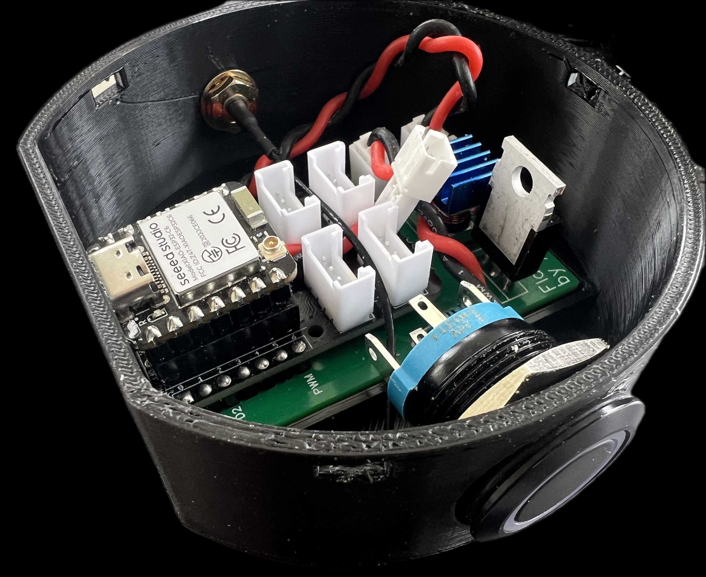
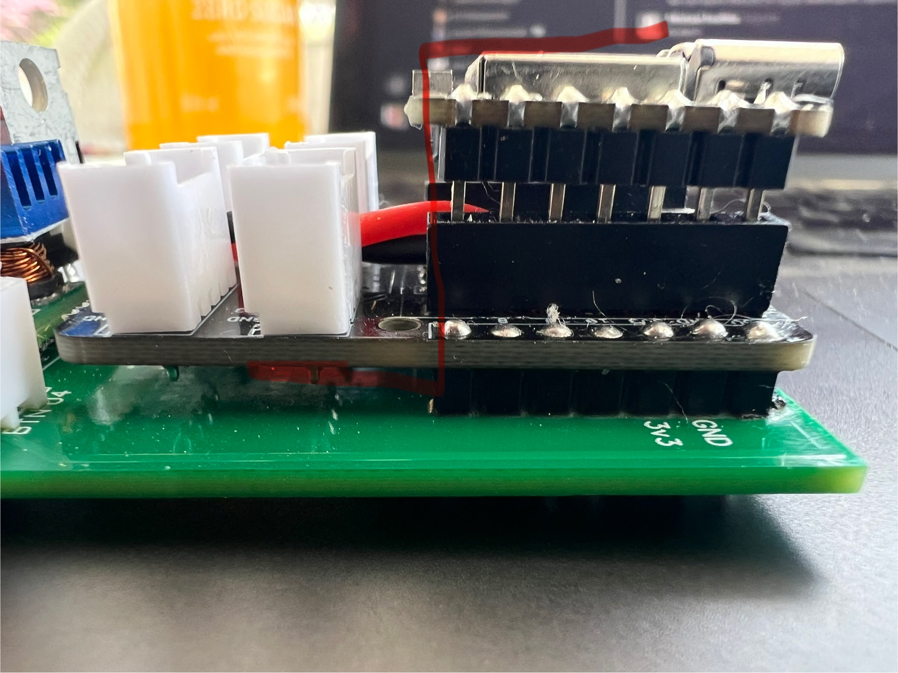
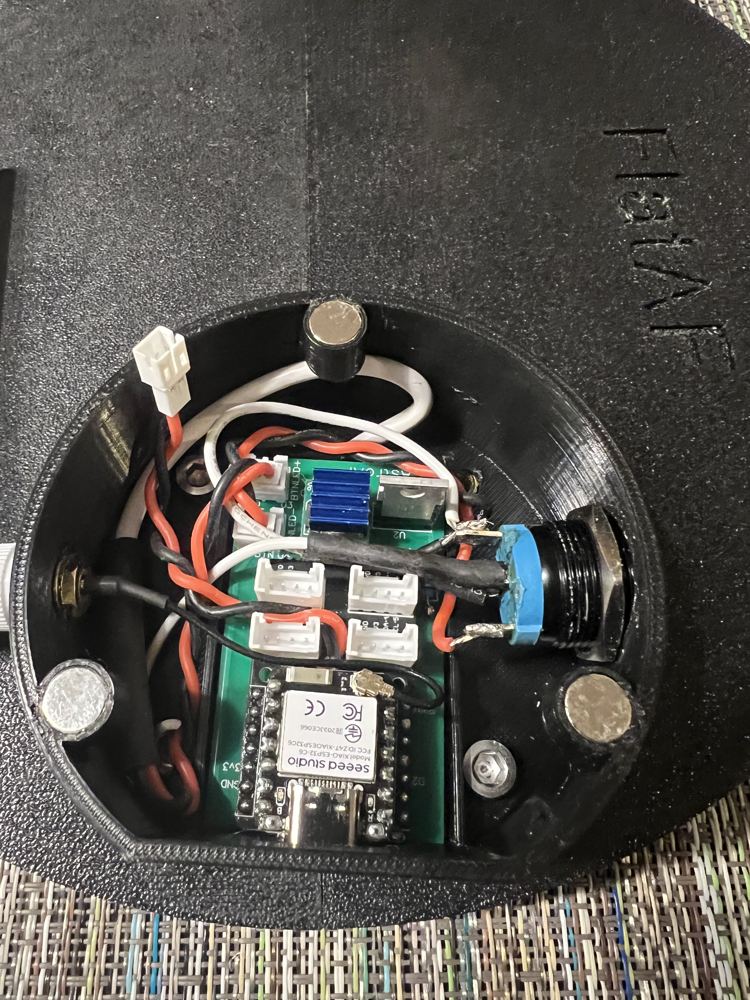
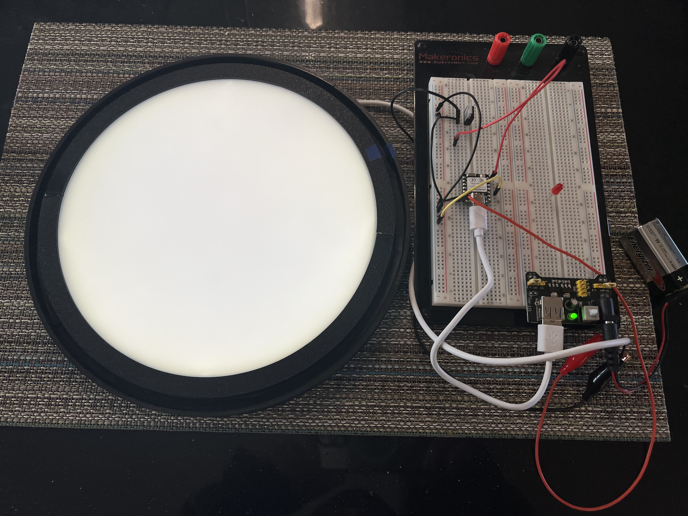
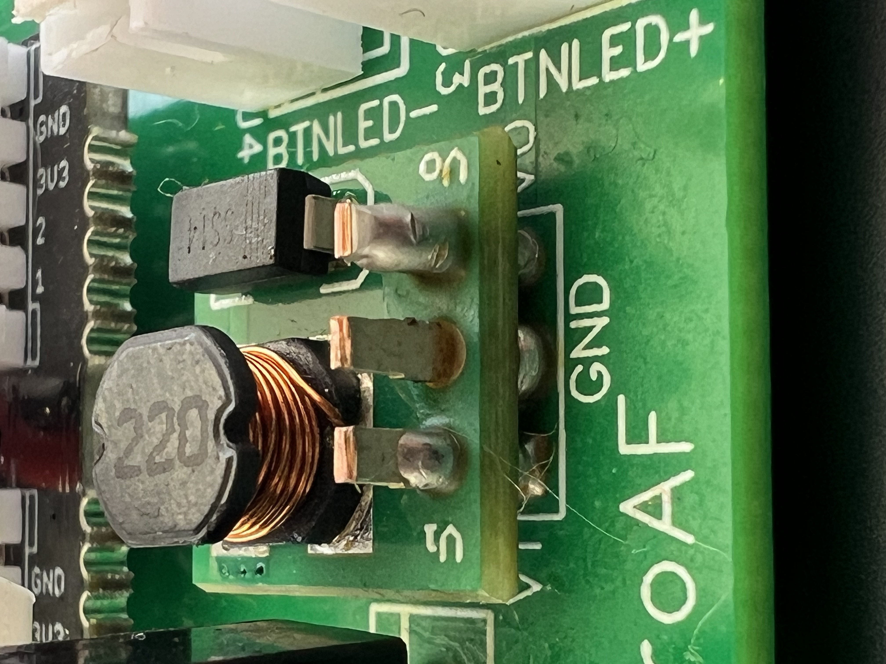
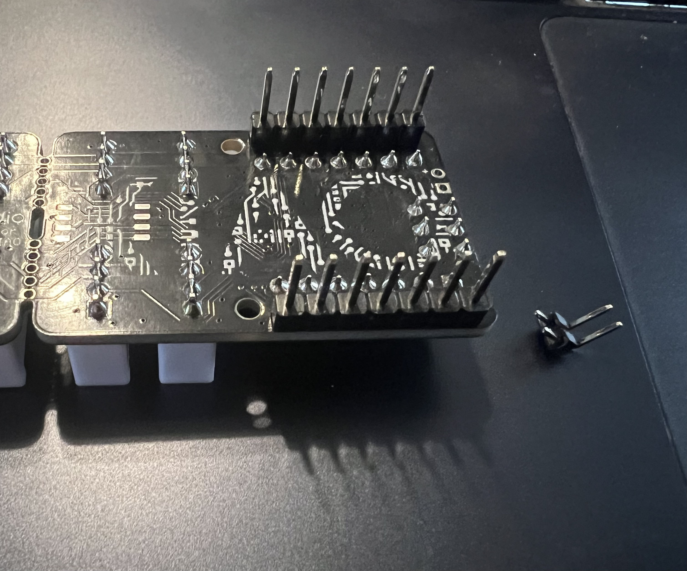
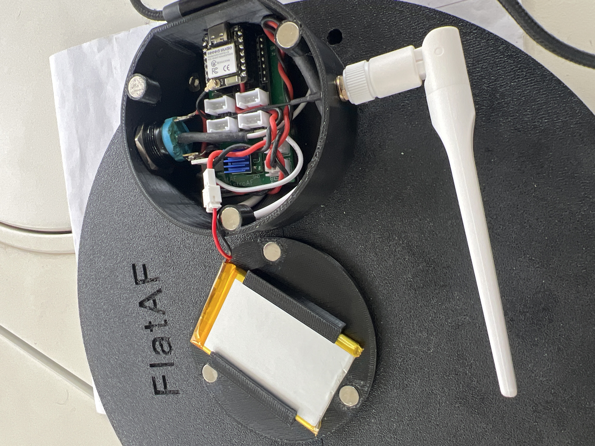
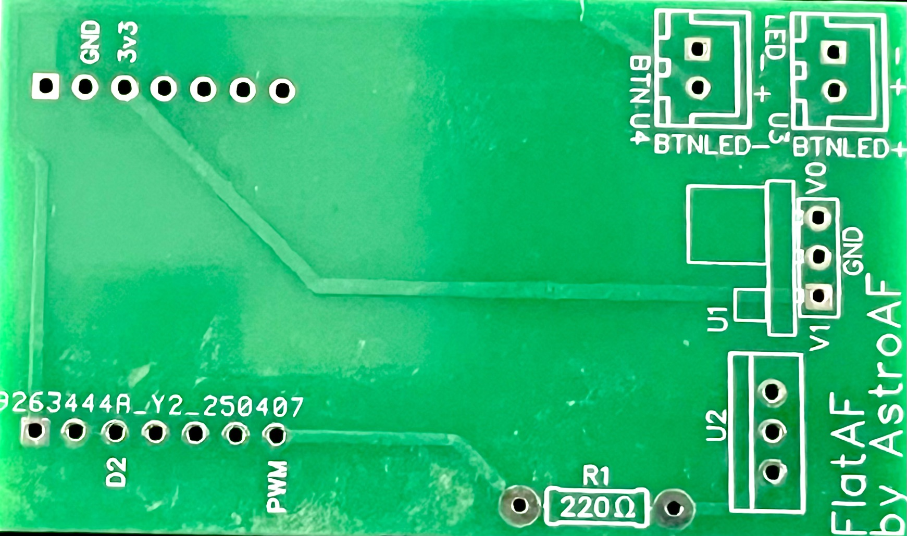
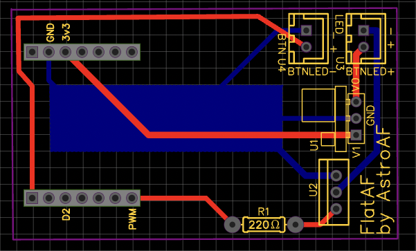
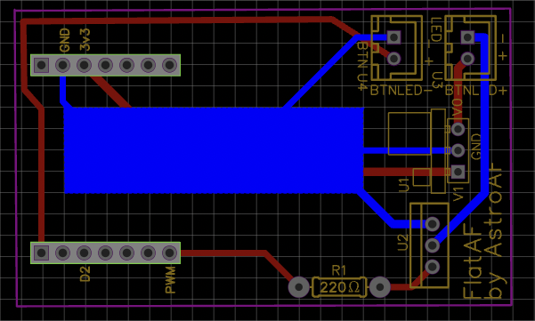

# FlatAF Design Reference

This document provides an in-depth look at the physical, electrical, and mechanical design of the FlatAF astrophotography flat panel system.

---

## Table of Contents
- [FlatAF Design Reference](#flataf-design-reference)
  - [Table of Contents](#table-of-contents)
  - [Overview](#overview)
  - [System Design Philosophy](#system-design-philosophy)
  - [System Layout](#system-layout)
  - [Build Images](#build-images)
    - [Board Stack](#board-stack)
    - [Breadboard Development](#breadboard-development)
    - [Enclosure Overview](#enclosure-overview)
    - [Panel Illumination Test](#panel-illumination-test)
    - [Voltage Boost Module Close-up](#voltage-boost-module-close-up)
    - [Xiao Pin Connections](#xiao-pin-connections)
    - [FlatAF Assembled](#flataf-assembled)
  - [Optional Tools \& Assembly Aids](#optional-tools--assembly-aids)
  - [Bill of Materials (BOM)](#bill-of-materials-bom)
  - [PCB Design](#pcb-design)
    - [FlatAF PCB](#flataf-pcb)
    - [Top View](#top-view)
    - [Bottom View](#bottom-view)
  - [3D Enclosure Files](#3d-enclosure-files)
  - [Device Dimensions](#device-dimensions)
  - [Power Design](#power-design)
  - [Related Downloads](#related-downloads)

---

## Overview

This document provides details about the mechanical and electrical design of the FlatAF flat panel. All design work was done by the author using Fusion 360 and EasyEDA and is provided for DIY builders, hobbyists, and educational use.

The design files will be made available as static downloads (Fusion 360 format, schematic, PCB, and BOM) from the [FlatAF Launch Blog Post](https://astroaf.space) once released.

> **Note:** These files represent a working, field-tested design. The 3D enclosure models are not fully parameterized and may be difficult to modify without rework. They are provided as-is to enable others to build their own working FlatAF panel.

AstroAF does not maintain version control for design files in this GitHub repository. Instead, finalized downloads will be hosted on the AstroAF website to simplify access for end users.

---

## System Design Philosophy

FlatAF prioritizes simplicity, compatibility, and robustness. The design leverages a common ESP32C6 platform, MOSFET dimming for LED control, and USB-C power input. Open-source hardware and software ensure users can build, modify, and repair their own devices.

---

## System Layout

FlatAF is a single-board system with minimal interconnects. Data and power routing are handled primarily by the custom PCB design. A few necessary interconnects include:
- A momentary pushbutton switch connected via a Grove-style connector
- A U.FL to SMA antenna cable for Wi-Fi connectivity
- A JST connector for the LiPo battery

The ESP32C6 development board used in FlatAF includes an integrated USB-C port for power input and data. No additional breakout modules are required.

The [PCB schematic](#pcb-design) illustrates the internal layout of major components, including ESP32, MOSFET control circuit, power management, and LED array output.

The image below shows the physical internal layout of the FlatAF system, including modular connectors, power management, and ESP32-based control. Key interconnects for antenna, pushbutton, and battery are all routed through the custom PCB.

---

## Build Images

### Board Stack

### Breadboard Development

### Enclosure Overview

### Panel Illumination Test

### Voltage Boost Module Close-up

### Xiao Pin Connections

### FlatAF Assembled

---

## Optional Tools & Assembly Aids

While not required to build FlatAF, the following tools and supplies can significantly ease the assembly, testing, and prototyping process.
These are general-purpose electronics tools, so most hobbyists may already have them on hand. If you're starting from scratch, affordable kits are widely available online.

- **Multimeter** – For voltage checks and continuity testing.

- **Hot Glue Gun or Mounting Tape** – For cable management or securing components.
- **Flush Cutters** – For trimming leads or PCB stubs.
- **Kapton Tape or Insulators** – For protecting nearby PCB traces or sensitive components.

- **X-Tronic 3060-PRO Solder Station** – $79 [Buy on Amazon](https://amzn.to/4lVWkxd)
- **SRA Solder 135 Rosin Paste Soldering Flux** – $8.49 [Buy on Amazon](https://amzn.to/4mkezfj)
- **Solder Wick Braid** – $5.99 [Buy on Amazon](https://amzn.to/4obxiM1)
- **Makeronics 1660 Solderless Breadboard** – $35.91 [Buy on Amazon](https://amzn.to/3JbkuF7)
- **Self Adjusting Wire Stripper - 3 in 1** – $16.99 [Buy on Amazon](https://amzn.to/45iwITX)

---

## Bill of Materials (BOM)

The following table lists all required components with direct links to purchase each item. All links are affiliate links, which help support AstroAF at no additional cost to you.

| Component | Description | Link | Estimated Price |
|----------|-------------|------|-----------------|
| ESP32-C6 Dev Board | Main microcontroller with onboard USB-C and Wi-Fi | [Buy on Amazon](https://amzn.to/45sDt6N) | $11.99 |
| Grove Base Shield | Connects pushbutton to ESP32 | [Buy on Amazon](https://amzn.to/3H3QP08) | $9.89 |
| MOSFET Module | Controls LED brightness | [Buy on Amazon](https://amzn.to/4ffMaot) | $0.99 |
| Voltage Booster | Boosts battery voltage to 5V | [Buy on Amazon](https://amzn.to/4l2MNCX) | $0.67 |
| 3.7V LiPo Battery | Rechargeable battery for wireless operation | [Buy on Amazon](https://amzn.to/3IZ8bvD) | $10.99 |
| ST-PH 2.0 2-Pin Connector | Battery power interconnect | [Buy on Amazon](https://amzn.to/4lY81n1) | $1.52 |
| JST XH 2.54mm Connector | Power connector for LED/MOSFET | [Buy on Amazon](https://amzn.to/3ISCyny) | $1.26 |
| Momentary Pushbutton (LED) | Used for power/network control | [Buy on Amazon](https://amzn.to/4lbFWYb) | $10.99 |
| External Wi-Fi Antenna | 2.4GHz 2.81dBi Antenna for XIAO/ESP32 | [Buy on Seeed Studio](https://www.seeedstudio.com/2-4GHz-2-81dBi-Antenna-for-XIAO-ESP32C3-p-5475.html) | $2.20 |
| Neodymium Magnets | Holds enclosure lid in place | [Buy on Amazon](https://amzn.to/46vtWgq) | $0.99 |
| Diffuser Panels | Harvested from ceiling-mount LED light panels | [Buy on Amazon](https://amzn.to/44WpdDj) | $12.99 |
| White COB LED Strip | Mounted to back panel for flat frame illumination | [Buy on Amazon](https://amzn.to/3Hfswwd) | $7.99 |
| USB-C Cable | For power input and charging | [Buy on Amazon](https://amzn.to/41jTUjm) | $12.99 |
| 220 ohm Resistor | For pushbutton LED current limiting | [Buy on Amazon](https://amzn.to/4lWaYVa) | $0.06 |
| PETG Filament | Used for 3D printing the enclosure components | [Buy on Amazon](https://amzn.to/4odP5lt) | $11.99 |
| Enclosure Screws or Fasteners | Used to secure the enclosure and internal components | — | $0.10 |
| Heat Shrink Tubing / Cable Sleeves | For protecting and bundling internal wiring | — | $0.10 |
| Heat Sinks or Thermal Pads (Optional) | For managing thermal output from LED panel | — | $0.10 |
| PCB Board (FlatAF) | Custom PCB ordered from JLCPCB via EasyEDA | — | $2.00 |
| **Total Cost** |  |  | **$96.65** |

> **Note:** The prices listed in this Bill of Materials reflect the actual cost paid at the time of purchase to build a FlatAF flat panel. In some cases, items were purchased in multi-packs or bulk quantities. When applicable, the cost per unit has been calculated by dividing the total case price by the number of items in the pack to provide an accurate per-item estimate. Listed prices are not guaranteed and may differ from current prices on Amazon. Listed prices were accurate at the time of purchase and do not include tax or shipping.

---

---

## PCB Design

### FlatAF PCB

### Top View

### Bottom View

---

## 3D Enclosure Files

*Fusion 360 project files (`.f3d`) and design notes for the 3D-printed enclosure will be linked here. These models are intended for review and modification using the native Fusion format. Images of the final assembled unit will also be included.*

---

## Device Dimensions

*Physical measurements of the assembled FlatAF device will be listed here for reference.*

---

## Power Design

The device can be powered via USB-C with support for 5V input. A 3.7V LiPo battery can also be connected via the onboard JST connector for wireless use. Charging is managed via an onboard charger IC.

---

## Related Downloads

- [FlatAF Design Downloads and Blog Post](https://astroaf.space) – Access the Fusion 360 files, PCB Gerbers, and additional resources on the official FlatAF launch page.

> **Note:** The design downloads will be made available at the above link shortly after the public launch of the FlatAF project. Please check back soon!